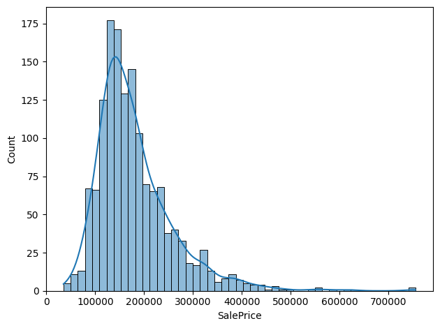
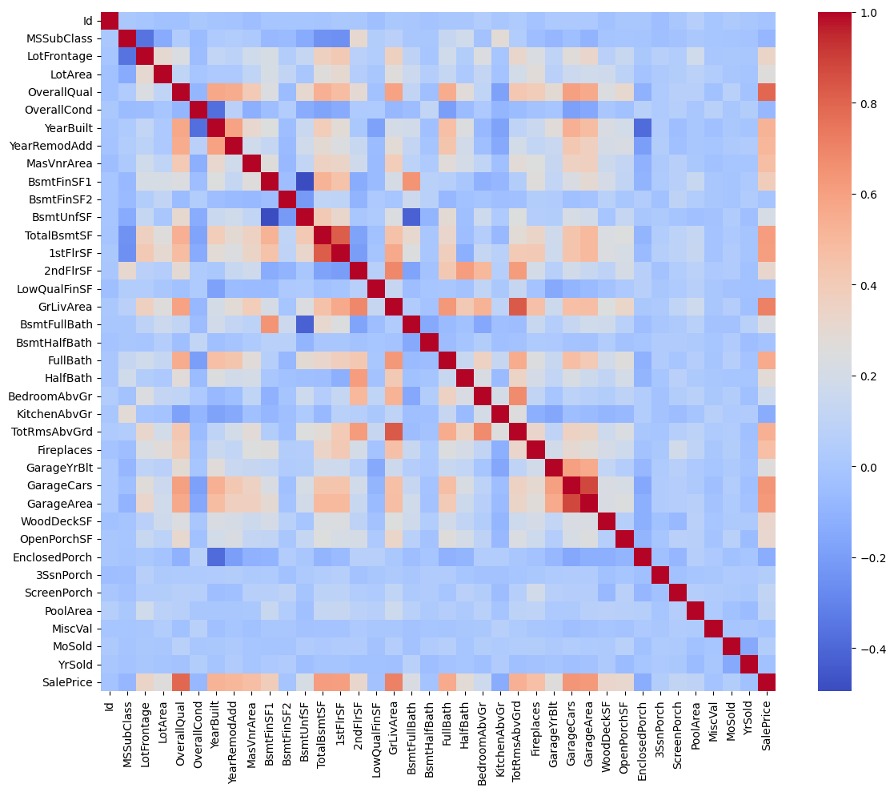
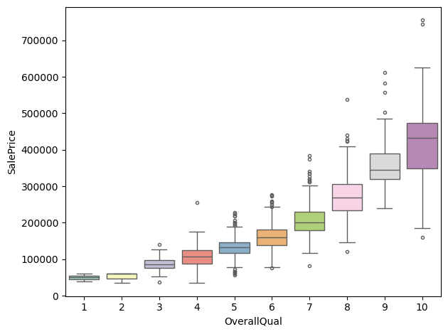
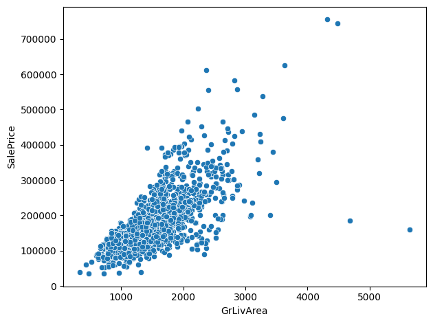
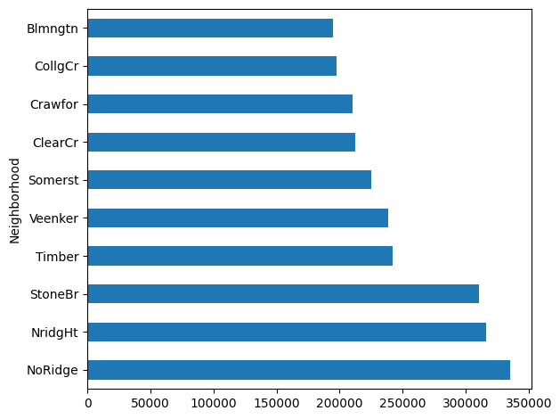
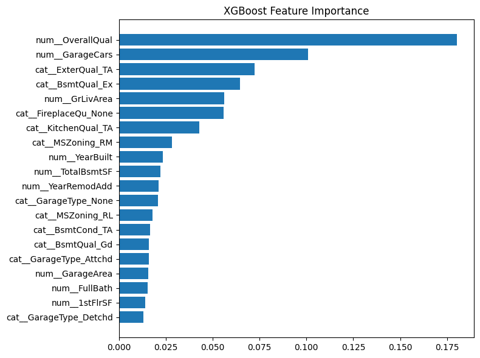
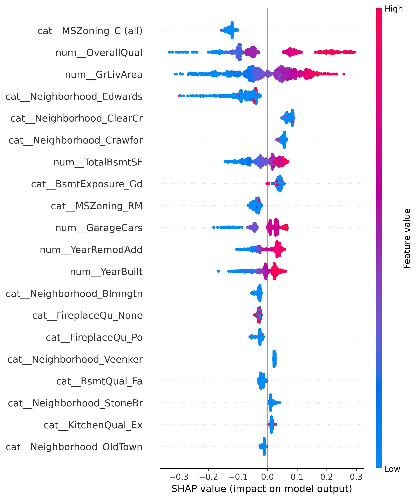

# House Price Prediction

## Objective

- Predict house prices using machine learning models on the Kaggle House Prices dataset.
- Build a regression model to predict house prices and identify the most important factors affecting housing value.
- This project also demonstrates an end-to-end MLOps workflow including experiment tracking, model serving, containerization, CI automation, and Kubernetes deployment.

## Technologies Used

- pandas
- scikit-learn
- XGBoost
- Optuna
- SHAP
- seaborn
- matplotlib
- MLflow
- FastAPI
- Docker
- GitHub Actions
- Kubernetes

## Dataset

Source:
- Kaggle House Prices: Advanced Regression Techniques
- https://www.kaggle.com/competitions/house-prices-advanced-regression-techniques

Records: 1460
Features: 79
Target: SalePrice

The dataset is not included in this repository due to Kaggle distribution policies. Please download it directly from Kaggle.

## EDA

### SalePrice Distribution
<p align="center">
  
</p>

### Correlation Heatmap
<p align="center">
  
</p>

### OverallQual vs SalePrice
<p align="center">
  
</p>

### GrLivArea vs SalePrice
<p align="center">
  
</p>

### Average SalePrice by Neighborhood
<p align="center">
  
</p>

## Data Preprocessing

- Missing value handling
- One-Hot Encoding
- Standard Scaling
- log1p transformation on SalePrice
- Feature selection based on XGBoost Feature Importance

## Model Comparison

| Model | RMSLE ↓ | R² Score ↑ |
|----------|----------|----------|
| Linear Regression | 0.142 | 0.908 |
| LightGBM | 0.153 | 0.880 |
| XGBoost | **0.136** | 0.904 |

XGBoost achieved the lowest RMSLE score, which is the official evaluation metric of the Kaggle House Prices competition. Therefore, XGBoost was selected as the final model.

## Feature Importance

<p align="center">
  
</p>

## Feature Selection

| Feature | RMSLE ↓ | R² Score ↑ |
|----------|----------|----------|
| Initial | 0.137 | 0.900 |
| Top10 | 0.150 | 0.880 |
| Top15 | 0.137 | 0.902 |

Top15 maintained performance comparable to the Initial feature set while reducing the number of input features. Therefore, Top15 was selected as the final feature set.

## SHAP Analysis

<p align="center">
  
</p>

OverallQual, GrLivArea, GarageCars, and YearBuilt showed the strongest influence on house price predictions. SHAP results were largely consistent with both EDA findings and feature importance analysis.

## Final Result

### Final Model

- XGBoost Regressor
- Optuna Hyperparameter Tuning
- log1p Transformation
- Top15 Feature Set

### Performance

- RMSLE: 0.137
- R²: 0.902

The trained model can be saved locally using joblib. Model files are excluded from the repository.

## MLOps Pipeline

- MLflow for experiment tracking
- FastAPI for model serving
- Docker for containerization
- GitHub Actions for CI
- Docker Hub for image registry
- Kubernetes for deployment, scaling, and service management

Pipeline:

Train Model
→ MLflow Tracking
→ FastAPI Serving
→ Docker Containerization
→ GitHub Actions CI
→ Docker Hub Registry
→ Kubernetes Deployment

### Docker Image

Docker image is automatically built and pushed to Docker Hub through GitHub Actions.

Docker Hub:
https://hub.docker.com/r/cyh996/house-price-api

## Kubernetes Deployment

The application was deployed to Kubernetes using the following resources:

- Namespace
- Deployment
- Service (ClusterIP)
- ConfigMap
- Horizontal Pod Autoscaler (HPA)
- Ingress
- Readiness Probe for traffic readiness checks
- Liveness Probe for automatic container health monitoring

Deployment workflow:

Docker Hub Image
→ Deployment
→ Pod
→ Service
→ Ingress

### Auto Scaling

- CPU-based Horizontal Pod Autoscaler (HPA)
- Min Replicas: 1
- Max Replicas: 5
- Target CPU Utilization: 70%

## Installation

For model training:

```bash
pip install -r requirements.txt
```

For model serving:

```bash
pip install -r serving/requirements.txt
```
## Usage

### Training

```bash
python main.py
```

### Model Serving

```bash
cd serving
uvicorn app:app --reload
```

### Docker

```bash
docker build -t house-price-api ./serving
docker run -p 8000:8000 house-price-api
```

### Kubernetes

```bash
kubectl apply -f k8s/namespace.yaml
kubectl apply -f k8s/
```

Check resources:

```bash
kubectl get all -n house-price
```

Delete resources:

```bash
kubectl delete namespace house-price
```